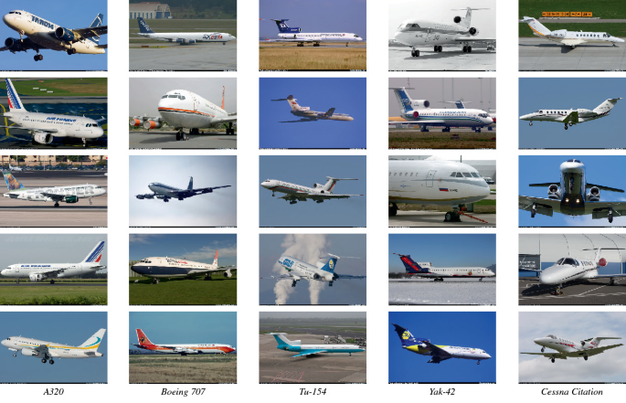
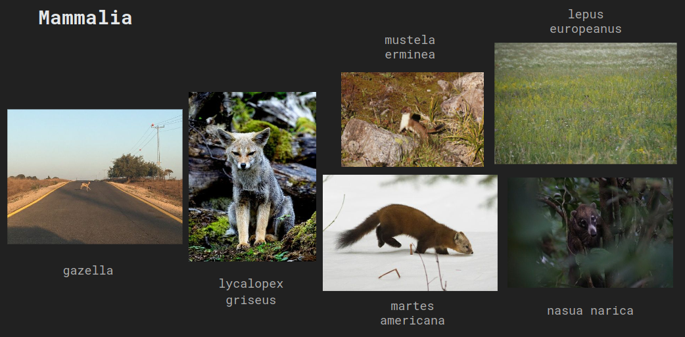

# Computer Vision Competition: Fine-Grained Classification 

## Fine-Grained Classification in Computer Vision
Among the realm of computer vision Fine Grained Visual Classification (FGVC) is a task which involves distinguishing between similar sub-categories belonging to the same Macro-category (e.g. birds, aircrafts, food or flowers). The main challenges of the task are the intra-class variability (e.g. different poses of the same bird), inter-class similarity (e.g. distinguishing between two types of birds could come down to a minor difference in the beak) and the higher cost of data compared to other tasks, as often domain experts are required to correctly label the images. To tackle this challenge, we have utilized 4 of the most relevant models in the field of computer vision: Resnet50, EfficientNetB5, Vitb16 and SwinT in combination with two optimization methods, the classic Stochastic Gradient Descent (SGD) and Sharpness Aware Minimization (SAM), and two modules specifically designed for the task, CMAL-NET and PIM.
## Repository Overview

This repository contains code for experiments conducted, methods utilized, and utilities. Here's a brief overview of the main components:

```
├── example.ipynb
├── experiments
│   ├── EfficientNetB5_FGVCAircraft_SAM
│   ┆   ├── config.json
│   ┆   └── events.out.tfevents.1717092624.lab4G24P6.1885
│   ┆
├── methods
│   ├── CMAL
│   ├── PIM
│   └── SAM
├── requirements.txt
├── train
│   ├── test.py
│   └── train.py
└── utility
    ├── gradcam
    ┆
```

### Experiments

The `experiments` directory contains configurations (`config.json`) to reproduce results and TensorBoard log files (`events.out.tfevents`) for visualizing them.

### Methods

The `methods` directory includes optimization methods and additional FGCV blocks to stuck on top of several backbones:

- **SAM (Sharpness-Aware Minimization)**: Implementation of the SAM method from the paper ["Sharpness-Aware Minimization for Efficiently Improving Generalization"](https://arxiv.org/pdf/2010.01412) by [davda54](https://github.com/davda54/sam/tree/main). SAM simultaneously minimizes loss value and loss sharpness. In particular, it seeks parameters that lie in neighborhoods having uniformly low loss. SAM improves model generalization and yields [SoTA performance for several datasets](https://paperswithcode.com/paper/sharpness-aware-minimization-for-efficiently-1). Additionally, it provides robustness to label noise on par with that provided by SoTA procedures that specifically target learning with noisy labels.

<br>

<p align="center">
    
</p>

<p align="center">
  <sub><em>ResNet loss landscape at the end of training with and without SAM. Sharpness-aware updates lead to a significantly wider minimum, which then leads to better generalization properties.</em></sub>
</p>

<br> 

- **PIM (Plug-In Module)**: Implementation of the module proposed by [Chou](https://github.com/chou141253) et al. in the paper ["A Novel Plug-in Module for Fine-Grained Visual Classification"](https://arxiv.org/abs/2202.03822). This module integrates into the most common backbones to improve the performance in fine grained image classification

<p align="center">
    
</p>


- **CMAL**: (brief description, paper, images)
  
### Training

The `train` folder contains essential scripts for training and testing:

- `train.py`: Instantiate a `Trainer` class, which manages training, testing, logging, etc.
- `test.py`: Script for testing trained models.

### Utility

The `utility` directory comprises various utility scripts and the implementation of Grad-CAM. Grad-CAM (Gradient-weighted Class Activation Mapping) is a technique to visualize and understand the decisions made by a Convolutional Neural Network (CNN) by highlighting the regions of the input image that are important for predictions. The Grad-CAM code is adapted from the official repository available [here](https://github.com/jacobgil/pytorch-grad-cam).

<br>

<p align="center">
    
</p>

<p align="center">
  <sub><em>A gradcam image produced using the FGVCAircraft dataset and a Resnet50 trained using SAM. The red pixels represent the aircraft's parts that mainly drive the model's prediction.</em></sub>
</p>

<br> 

### Datasets
To train and test our models we utilized 3 different fine-grained datasets:

- **Flowers102:** A dataset containing 102 flower categories, with each class consisting of 40 to 258 images, for a total of about 8200. These flowers are commonly found in the United Kingdom, and the dataset features significant variations in scale, pose, and lighting conditions.

<p align="center">
    
</p>

<p align="center">
    
- **FGVCAircraft:** A comprehensive collection of 100 classes of different aircraft, hierachically organized by variant, family and manufacturer. Each class has 100 images, for a total of 10k images, split equally among training, validation and test

<p align="center">
    
</p>

<p align="center">
    
- **Mammalia:** The dataset used in our course's final competition, it consists of 100 different classes of mammals, each labeled with its latin name, with 50 images in the training set and 10 in the test

<p align="center">
    
</p>

